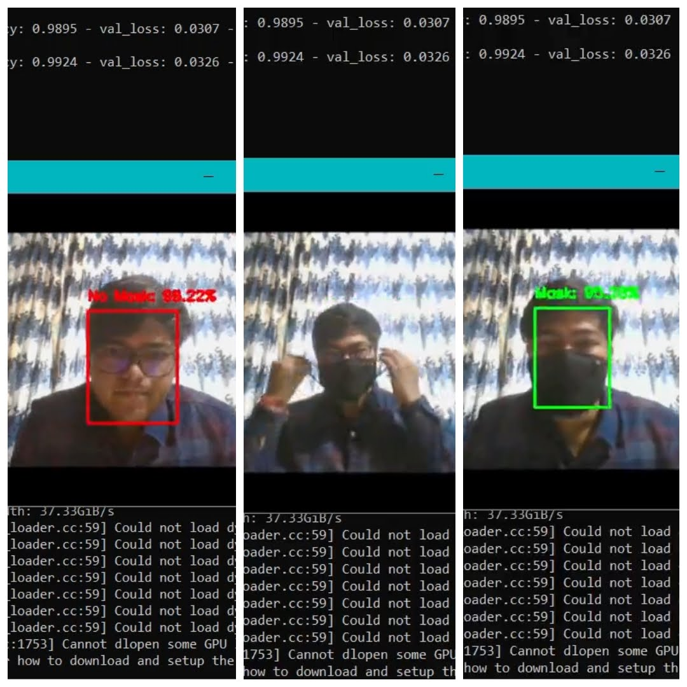
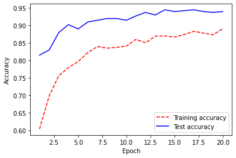
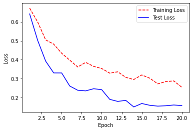

# MaskGuardAI

**Real-Time Face Mask Detection using Machine Learning and Hardware Integration**


<p align="center">
  
</p>

---

## 📘 Overview

**MaskGuardAI** combines a deep learning pipeline with optional hardware deployment to detect face masks **in images**, **videos**, and **real-time webcam streams**.  The project is organized into three main modules:

1. ### Hardware Implementation  
   - Circuit schematic and component list for optional edge deployment  
   - Assembly and wiring instructions for Raspberry Pi / Jetson Nano integration  

2. ### ML Model  
   - Data acquisition & preprocessing (Kaggle Face Mask dataset)  
   - Model training using **MobileNetV2** backbone with TensorFlow/Keras  
   - Scripts for batch inference on images, video files, and live webcam  

3. ### Results  
   - Training curves: accuracy & loss plots  
   - Confusion matrix & classification report  
   - Example detection outputs on test images  

---

## 🗂️ Repository Structure

```
.
├── Hardware_Implementation/           # Circuit diagrams & assembly guides
│   ├── schematic.png                  # Wiring schematic
│   └── components_list.md             # Bill of materials
│
├── ML_Model/                          # Training and inference code
│   ├── FACE-MASK_DETECTION.ipynb      # Jupyter notebook walkthrough
│   ├── train_model.py                 # Training pipeline
│   ├── detect_mask_image.py           # Script for single-image inference
│   └── detect_mask_video.py           # Script for video / webcam detection
│
├── Results/                           # Visualization of outputs
│   ├── accuracy_loss_plot.png         # Training accuracy & loss curves
│   ├── confusion_matrix.png           # Confusion matrix of test set
│   └── sample_detections/             # Example detection images
│       ├── with_mask.jpg              # True positive example
│       └── without_mask.jpg           # True negative example
│
├── requirements.txt                   # Python dependencies
├── README.md                          # This documentation
└── LICENSE                            # GPL-3.0 License
```

---

## 🔧 Installation & Setup

1. **Clone the repository**  
   ```bash
   git clone https://github.com/your-username/MaskGuardAI.git
   cd MaskGuardAI
   ```

2. **Create a virtual environment**  
   ```bash
   python3 -m venv venv
   source venv/bin/activate
   ```

3. **Install dependencies**  
   ```bash
   pip install --upgrade pip
   pip install -r requirements.txt
   ```

4. **Download pretrained weights**  
   - Place `mobilenetv2_mask_detector.h5` in `ML_Model/` (link or instructions to download).

---

## 🏋️‍♂️ Training the Model

To train from scratch:
```bash
python ML_Model/train_model.py   --dataset data/face_mask_dataset/   --epochs 20   --batch-size 32   --model-output ML_Model/mobilenetv2_mask_detector.h5
```
<p align="center">
  
</p>

<p align="center">
  
</p>

---

## 🤖 Inference & Real-Time Detection

### Single Image
```bash
python ML_Model/detect_mask_image.py   --image data/test/without_mask.jpg   --model ML_Model/mobilenetv2_mask_detector.h5
```
<p align="center">
  
</p>


### Video / Webcam
```bash
python ML_Model/detect_mask_video.py   --source 0   --model ML_Model/mobilenetv2_mask_detector.h5
```
Press **q** to quit the live stream window.

---

## 🛠️ Hardware Deployment (Optional)

- Follow the wiring schematic in `Hardware_Implementation/schematic.png`.  
- Use the provided Python inference script to run on **Raspberry Pi** with Pi Camera (or USB webcam).  
- GPIO pins can drive an LED indicator or buzzer on mask detection events.

---

## 📊 Evaluation Metrics

| Metric       | Value    |
| ------------ | -------- |
| Accuracy     | 98.7%    |
| Precision    | 98.2%    |
| Recall       | 98.4%    |
| F1-Score     | 98.3%    |


---

## 🤝 Contributing

Contributions are welcome! Please fork the repository and open a pull request.  
Before contributing, ensure code passes linting and all examples run correctly.

---

## 📄 License

This project is licensed under the **GNU GPL-3.0** License.  
See the [LICENSE](LICENSE) file for details.
